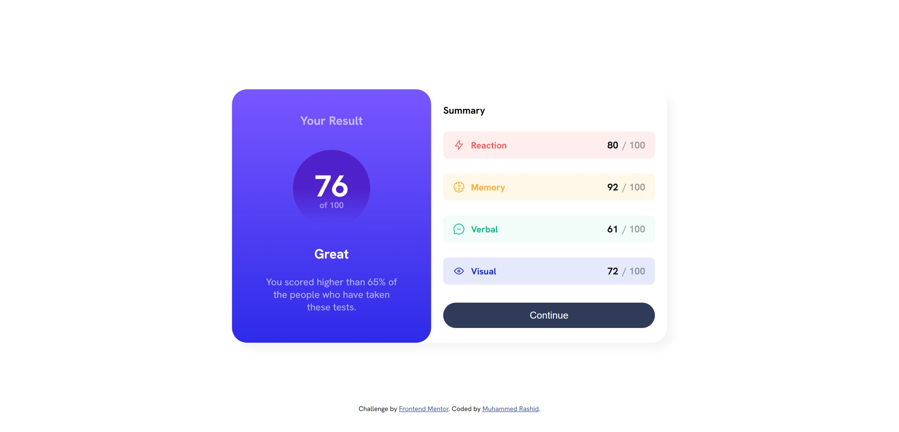
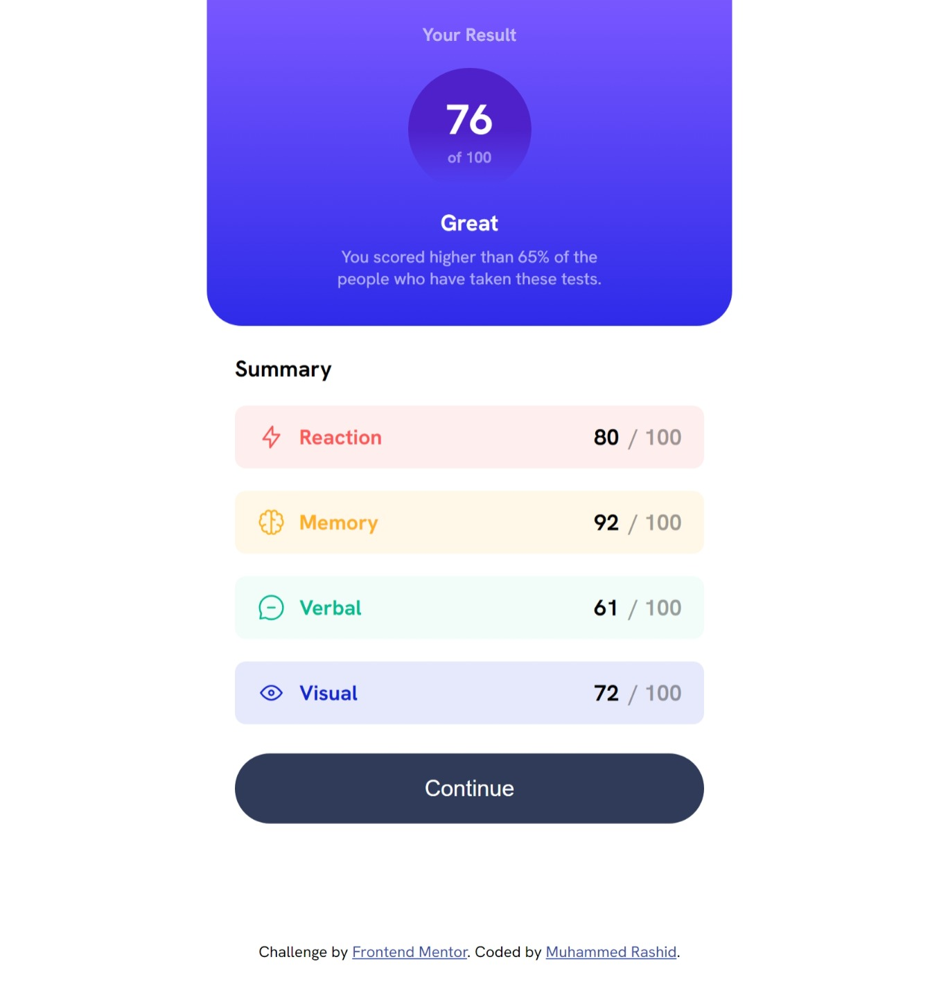

# Frontend Mentor - Results summary component solution

This is a solution to the [Results summary component challenge on Frontend Mentor](https://www.frontendmentor.io/challenges/results-summary-component-CE_K6s0maV). Frontend Mentor challenges help you improve your coding skills by building realistic projects.

## Overview

### The challenge

Users should be able to:

- View the optimal layout for the interface depending on their device's screen size
- See hover and focus states for all interactive elements on the page

### Screenshots




### Links

- [Solution URL](https://github.com/MH-Rashid/results-summary-component)
- [Live Site URL](https://mh-rashid.github.io/results-summary-component/)

## My process

### Built with

- Semantic HTML5 markup
- CSS custom properties
- Flexbox
- Mobile-first workflow

### What I learned

What are you most proud of, and what would you do differently next time?

- Very close to the final design. Learnt how to use gradients. Lot of practise with flexbox Great step forward in handling position of footer in this project, but still not the most clean styling.

What challenges did you encounter, and how did you overcome them?

- Flexbox: in the Summary section's skill boxes, struggled to keep the first 2 elements (icon and skill name) at the start and the last element (score) at the end without grouping the first 2 elements into a div, i.e. keeping them both as direct children of the flexbox. Achieved by giving 3rd element margin-left: auto, but ideally wanted to fix the issue using flexbox properties and knowhow
- Manipulating position of the card when its width and height were set as percentages. Its size obviously changes as I resize the browser window, which made it difficult to set the correct styling when it came to making the page responsive. Solved by switching to fixed height and width in pixels, but would like to learn how to keep relative measurements such as rem / percentages and still manage responsive styling
- Footer issues. Managed to keep it at the bottom and center even when scrolling. Di so by setting position to static and defining suitable padding to ensure it remains at the bottom at different viewing RWD breakpoints. But ran into an issue when exceeding the mobile-width breakpoint and entering desktop view -- the footer would jump to the top of the page. Still not sure why -- any ideas? Had to "force fix" by setting top padding

```html
<div class="skill-box reaction">
  
  <span class="skill-name">Reaction</span>
  <span class="skill-score">80</span>
  <span class="skill-out-of-100">/ 100</span>
</div>
```

```css
.result {
  /* other css */
  background: linear-gradient(
    to bottom,
    var(--light-slate-blue) 0%,
    var(--light-royal-blue) 100%
  );
}
```

### Continued development
- Know when to use pixels and when to use relative measurements like rems
- Be able to use relative measurements effectively and in tandem with responsive design
- Improve flexbox skills
- Become more confident with positioning especially with semantic elements like headers and footers
- Improve workflow, making it more methodical and efficient
- Find a suitable convention for naming css classes and when to rely on native html tags for styling